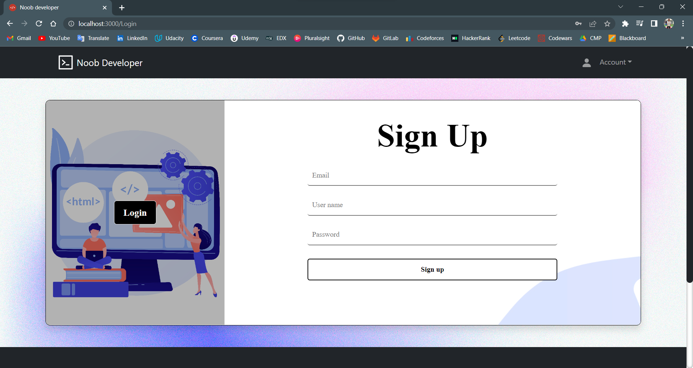
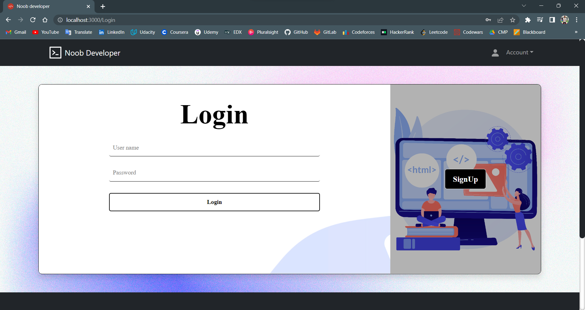
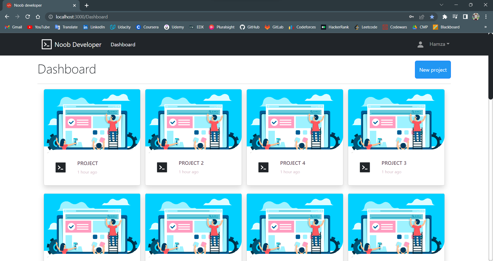
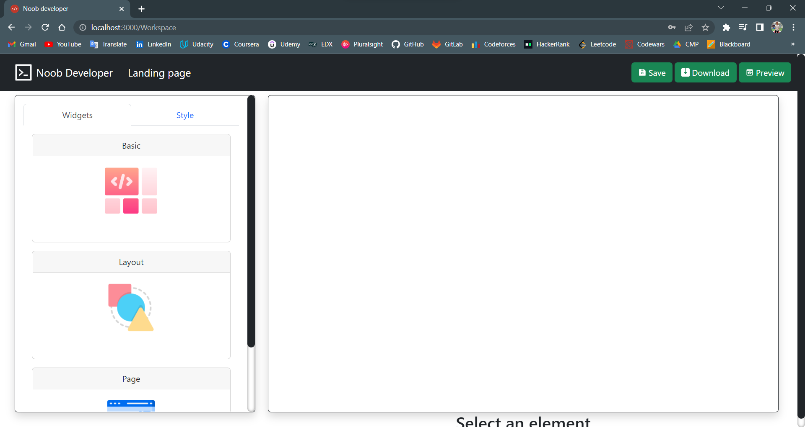
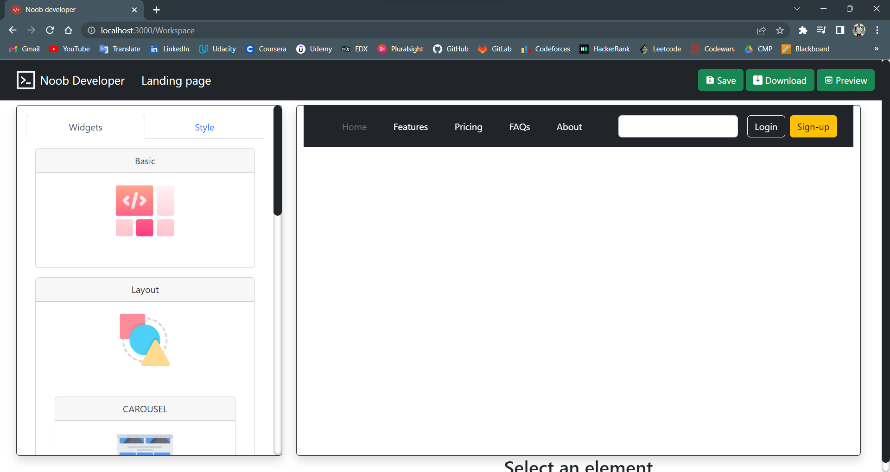
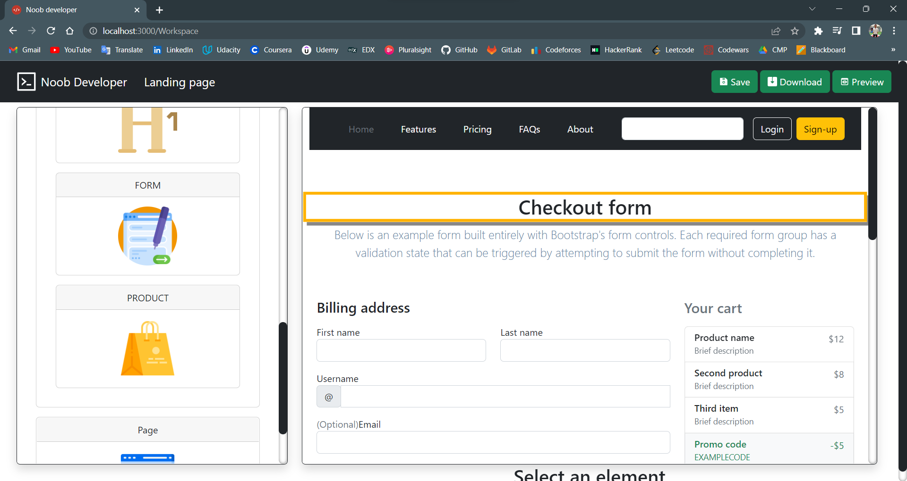

# [Nope Developer]()


<p align="center"></p>

**Nope developer** is a Low-code / No-code opensource platform to build full web or mobile apps. Easy and Fast development where the user can make his own application with no need of a strong coding background, the user can design it by draging and droping the different widgets, show and edit its code, save it for later editing and download it as a zip folder.  (currently, you can design a **web applicaton** with **HTML/CSS and Js**)  


## Table of Contents

- [Built with](#built-with)
- [File Structure](#file-structure)
- [Features](#features)
- [Development](#development)
- [API](#api)
- [License](#license)


## Built with

- [React JS](https://reactjs.org/)
- [react-router-dom](https://reactrouter.com/en/v6.3.0)
- [react-bootstrap](https://react-bootstrap.github.io/)
- [bootstrap](https://getbootstrap.com/)
- [react-ace](https://www.npmjs.com/package/react-ace)
- [react-icons](https://react-icons.github.io/react-icons/)


<details><summary>Detailed Structure</summary>
<p>

```bash
├───buildJson
├───data
├───docs
│   ├───fonts
│   ├───scripts
│   │   └───prettify
│   └───styles
├───public
└───src
    ├───Assets
    │   └───images
    │       ├───services
    │       └───work
    ├───Authentication
    ├───Code snippets
    ├───Components
    │   ├───DesignGroup
    │   ├───DesignMetaDate
    │   ├───Footer
    │   ├───home
    │   │   ├───about
    │   │   ├───homes
    │   │   └───services
    │   ├───Image
    │   ├───Navbar
    │   ├───OptionList
    │   ├───Project
    │   ├───ProjectModal
    │   ├───Projects
    │   ├───SideBar
    │   ├───StyleBar
    │   ├───Widgets
    │   │   ├───Body
    │   │   └───Widget
    │   ├───WidgetSide
    │   └───WorkspaceNavBar
    ├───Containers
    │   ├───Dashboard
    │   ├───EditPage
    │   ├───LandingPage
    │   ├───Login
    │   ├───LoginSignupContainer
    │   ├───PreviewPage
    │   ├───SignUp
    │   └───Workspace
    ├───Contexts
    ├───Helpers
    └───Hooks
  
  
```
  </p>
</details>


## Features

### Demo

<video  src="https://drive.google.com/file/d/1q4FH6Q3Q9XMNDyEWZCGfXLfZ_WZQFIYB/view?usp=share_link"  alt="login" align="center"/>|

* **Design Page**

| login | register |
|--|--|
|||

| Dashboard | New project |
|--|--|
|||

| Workspace |
|--|
||


| Header | Form |
|--|--|
|||

| CSS & Javascript | Change text |
|--|--|
|||

| Preview | Download |
|--|--|
|||

| Final result |
|--|
||


---
## Development

Clone the repository and install all the necessary dependencies (`npm` is highly recommended)

```sh
$ git clone https://github.com/Abd-ELrahmanHamza/Nope-developer.git
$ cd Nope-developer
$ npm install
```
Start the dev server

```sh
 npm start
```

## License

> This software is licensed under Apache License 2.0 License, See [License](./LICENSE)

